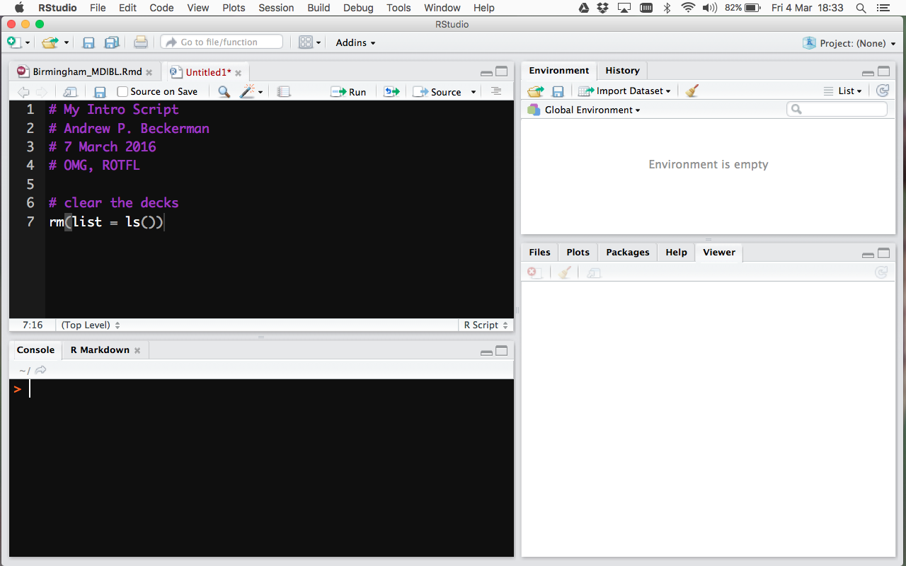
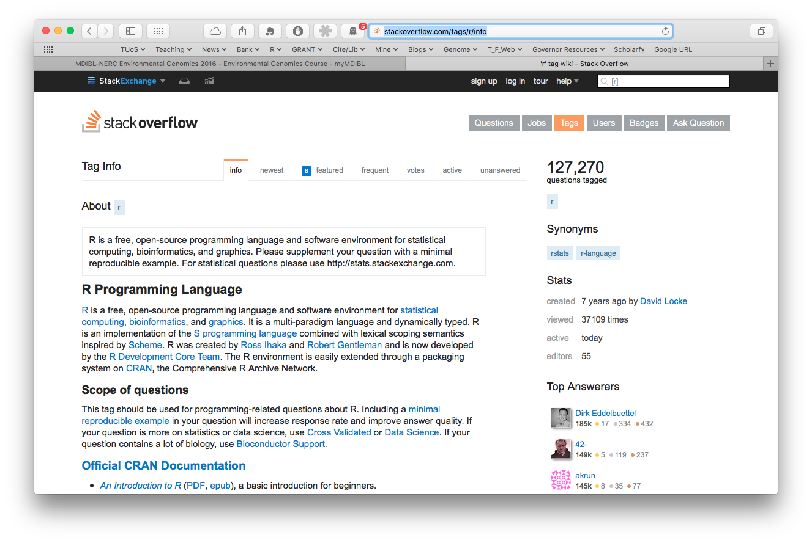

```{r setup, include=FALSE}
knitr::opts_chunk$set(echo = TRUE)
```
## Using R with Rstudio is AWESOME.  
Building an annotated, archived, repeatable, share-able cross platform record of what you do.

4 panes: 

* the console (engine)
* the script (your code)
* Plots/Packages
* Data Stuff



## Getting Help
There are many ways.  Inside R, we use `?` and `??` or `help.start()`, which spawns a web browser.  Outside R, we use.... google!  But there is something MUCH better.  Stackoverflow.  This has an R channel, and here you will find VERY constructive answers to questions, including code and graphs.  It has rapidly become the go-to location for help.  Lots of R developers are active there.

[LINK to StackR](http://stackoverflow.com/tags/r/info)



## Using R as a calculator

R is a big giant calculator.  Lets practice in the CONSOLE.  As you do these, WATCH what RStudio does with ()'s

## Practical
```{r, eval = FALSE}
# ----------------------------------------------------------------------
# BASIC PRACTICAL
# ----------------------------------------------------------------------
# Maths and Functions
1+1
2*7/8-9
log(exp(1))
log10(1000)
log(1000)
sin(2*pi)
2^10
sqrt(81)
```

#### *What you should know from this.*

* R does maths correctly
* the default logarithm is ln, not base 10
* R has function and objects

Lets look at what more R can do.  Here we see the basics of how R can make sequences.  We see it can make integers using ':' and sequences of certain lengths or 'by' certain steps.

## Moving to the script.
Lets start using the script now.  Add some basic annotation at the top and a good practice activity - clearing R's brain.

```{r, eval = FALSE}
# NAME
# DATE
# Intro to R script

# clear R's brain
rm(list = ls())
```

Now, lets have some more fun... building sequences of numbers to see how R works.

```{r, eval = FALSE}
# Sequences, Vectorisation
1:10
seq(from = 1, to = 10, by = 1) # note the three arguments, from, to and by
seq(from = 1, to = 10, length = 12) # note the three arguments, from, to and length
```

#### *What you should know from this.*

* R can make sequences of integers easily
* seq() is a function with at least three arguments.
* from, to, by is a sequence in "steps"
* from, to, length is a sequnce of a fixed number of numbers.

## Assignment of numbers, vectors and data to *objects*
You can make objects in R.  We call this ASSIGNMENT, and we typically use `<-` (not `=`, though it is possible)

```{r, eval = FALSE}
# assignments
x <- 1:10

# look at it
x

# use it to make another variable
y <- x^2

# work with both
x+y 
x*y
```

#### *What you should know from this.*

* You can create objects to use.
* The objects can be vectors, matrices, data frames etc.
* R can perform operations with objects.
* operations are by default *element - by - element*
* there is facility for matrix multiplication and linear algebra

## Seeing what you've done, inside R.

Lets move focus to the console for a moment.... wait.  Have you saved the script?
Use CTRL - 2.  Ohhh - check out the View Menu...
Once there, type:

`ls()`

```{r, echo = FALSE}
# A UNIX LIKE VIEW OF WHAT YOU'VE MADE - remember ls in unix is listing what is in the directory

# ls() lists the objects in your workspace
ls()
```

`ls()` in R is like `ls` in unix/linux.  It is listing the objects....

## Making some graphics.... BASE graphics

Here we introduce the basics of making a plot.  There are several ways to make pictures.  The most popular now is ggplot2, but there is also the lattice library.  More on packages and libraries below.

Start by making some data.  Then, roll this data in to a data frame, which is like a spreadsheet.

We use the base function `plot()` and a *formula* that specifies the y and the x axes of the plot.

```{r}
# Your first plot
x <- 1:10
y <- x^2

myDat <- data.frame(Beer = x, Goggles = y)
myDat
```

#### *What you should know from this.*

* data.frame makes a spreadsheet like object with columns
* we name the data frame using `<-`
* we name the columns inside the data.frame using `=`

Right...lets make the picture!

```{r}
# FORMULA INTERFACE
plot(y ~ x, data = myDat, type = "b")
```

#### *What you should know from this.*

* plot is nice
* when the data frame has column names that are nice, they look nice on the graph
* the `type` argument *b* is for both.  *p* is for points only. *l* is for lines only.

Plots can be customised.... here we alter the limits of the y-axis (`ylim`), the label on the x-axis (`xlab`), the size points (character expansion: `cex`), and make the points filled (point character; `pch`) with cornflowerblue-ness (`col`) ....

```{r}
# FORMULA INTERFACE
plot(y ~ x, data = myDat, type = "b",
     ylim = c(0,120),
     xlab = "Good Beer",
     pch = 19, cex = 2, col = "cornflowerblue")
```

## Back to some Mechanics... Managing Packages
In your 'omics life, you will need to access packages from TWO locations.  CRAN, which is the *C*omprehensive *R* *A*rchive *N*etwork, and Bioconductor.  

[CRAN](http://star-www.st-andrews.ac.uk/cran/) has ~7500 packages available and they are curated at the CRAN Task Views website:

Packages: [LINK](http://star-www.st-andrews.ac.uk/cran/web/packages/) `http://star-www.st-andrews.ac.uk/cran/web/packages/`

TaskViews: [LINK](http://star-www.st-andrews.ac.uk/cran/web/views/)
`http://star-www.st-andrews.ac.uk/cran/web/views/`

[Bioconductor](https://bioconductor.org) is more focused on 'omics, and has a different curation mechanism

Here are the basics for installing stuff.

```{r, eval = FALSE}
# ----------------------------------------------------------------------
# Installing packages
# ----------------------------------------------------------------------

# R-CRAN
# get dplyr and ggplot2 - see http://ggplot2.org and https://cran.rstudio.com/web/packages/dplyr/vignettes/introduction.html
# and just use google
# install.packages gets packages and installs them
# SEE RSTUDIO TOO!

install.packages(c('ggplot2', 'dplyr'))

# R - bioconductor
# the first line grabs a special piece of code to make it easy to get packages from
# BIOCONDUCTOR.
# The second line gets a specific set of packages.... you'll be using these!

source("https://bioconductor.org/biocLite.R")
biocLite(c("edgeR", "DESeq2", "KEGGREST", "pathview","org.Dr.eg.db")
```

Some stuff will happen on your screen when you do this...

You have to think about packages like this.  You INSTALL PACKAGES from an app store.  To use them, however, we need to invoke a second function (like pressing on the icon).  This is called `library()`

Typically, we'd do the isntallations - and you only need to do this ONCE - and then put the library() commands at the top of your script....

```{r, eval = FALSE}
# I need these libraries
library(KEGGREST)
library(pathview)
library(org.Dr.eg.db)
```

## Last *formal* thing - reading data in from the web, or your own computer.

```{r}
# ----------------------------------------------------------------------
# read some data using read.csv()
# ----------------------------------------------------------------------

# this is a path to data on the web
UrlAddress<-'https://raw.githubusercontent.com/andbeck/RDatas/master/myDF.csv'

# # you will often use a path on your computer
# compAddress<-'C:/Documents/RStuff/myDF.csv' # windows
# compAddress<-'~/Documents/RStuff/myDF.csv' # linux/unix/osx

# get the data
myDF <- read.csv(UrlAddress)
str(myDF)
```

```{r}
# # with comp
# myDF <- read.csv(compAddress)

# # also directly using a path
# myDF <- read.csv('~/Documents/Rstuff')
```

```{r}
# ----------------------------
# make a list (also common)
myList <- list(x = 1:10,
   y = LETTERS[1:5],
   w = matrix(rnorm(100,0,1), nrow = 10, ncol = 10, byrow = TRUE))
```

## What lies below is a bit about how to find your way around data
'omics data structures are highly variable.  Things are stored in data frames and in lists.  Below you have 
- an introduction to `[row, column]`, `$` for grabbing bits of data frames
- an introducto to `subset()` for more efficient grabbing
- an introduction to `[[ ]]` for grabbing things from lists

You'll want to work through these before tomorrow's activities.

-NOTE - lots of people are using the package dplyr now with verbs select(), slice(), filter();  VERY good tutorials online

```{r}
# ----------------------------------------------------------------------
# Explore the data with important functions in R
# [ ] and $ and ==
# REMEMBER: ROWS THEN COLUMNS
# ----------------------------------------------------------------------
# NOTE - lots of people are using the package dplyr now with
# verbs select(), slice(), filter()
# VERY good tutorials online
# ----------------------------------------------------------------------

# BASE BASICS
myDF[5,2] # 5th row, 2nd column
myDF$expression # expression column
myDF[,1] # column 1
myList[[3]] # 3rd piece of the list => w
```

```{r}
# MORE harder
myList[["w"]][2,] # get the ninth row from the matrix w that is the third element in myList
myList$w[2,] # get the ninth row from the matrix w that is the third element in myList

# More Harder
myDF[51:100,] # rows 51:100 are labeled "B"
myDF[myDF$category=="B",] # rows 51:100, but access functionally by definition in category column.
```


```{r}
# ----------------------------------------------------------------------
# learn how to use subset
# ----------------------------------------------------------------------
subset(myDF, category=="B") # rows
subset(myDF, select = "expression") # columns
subset(myDF, category=="B", select = "expression") # both
```

## summarising data
Here we introduce the use of BASE functions aggregate and tapply, which are used to generate means, standard deviations etc of data by grouping variables (e.g. parts of experimental designs)

-NOTE - lots of people are using the package dplyr now with verbs `select()`, `slice()`, `filter()` along with `summarise()` and `group_by()`;  VERY good tutorials online

```{r}
# ----------------------------------------------------------------------
# Summarize the data using tapply and aggregate
# ----------------------------------------------------------------------
with(myDF, 
	aggregate(x = expression, by = list(category), FUN = mean))

# OR
aggregate(expression ~ category, data = myDF, FUN = mean)

#
with(myDF, 
	tapply(X = expression, INDEX = list(category), FUN = mean))
	
```


```{r}
# YOU CAN assign the values returned by subset, aggregate and tapply to objects
mean.nums <- with(myDF, 
	tapply(X = expression, INDEX = list(category), FUN = mean))
```

## a more in depth overview of various plottings you can do
MANY methods for making plots with `omics data.
- advanced use of `plot()`
- introduction to `ggplot2`
- introduction to `lattice`

```{r}
# ----------------------------------------------------------------------
# make some different types of plots
# plot, barplot, histograms, heatmaps
# reinforce function and arguments
# ----------------------------------------------------------------------

# plot, using the formula method - the best
plot(expression ~ size, data = myDF, pch = 21, bg = "red",
   xlab="Size", ylab = "Expression")
```

```{r}
# alter the color, and use alpha transparency
plot(expression ~ size, data = myDF, pch = 19, cex = 3, col = rgb(0,0,1,alpha = 0.5))

# specifying categories of colours on the points based on a categorical column
# note the special use of [ ]'s
plot(expression ~ size, data = myDF, 
	pch = 19, col = c("green","blue")[category])
```

```{r}
# lattice graphics - super fun exploration
library(lattice) # loads a special graphics library into R's brain

xyplot(expression ~ size | category, data = myDF) # panels
xyplot(expression ~ size, groups = category, data = myDF) # groups

# ggplot graphics - very popular now too
library(ggplot2)
ggplot(myDF, aes(x = size, y = expression))+
	geom_point(col = "red")+
	facet_wrap(~category)
```

```{r}
# heatmaps - very common in molecular data
?heatmap
heatmap(myList[[3]])
heatmap(myList$w)
