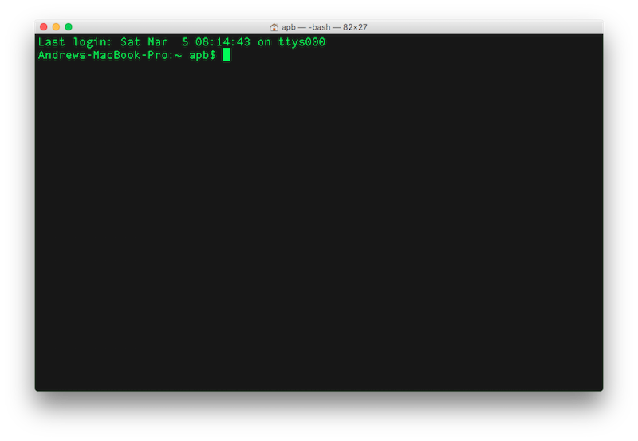
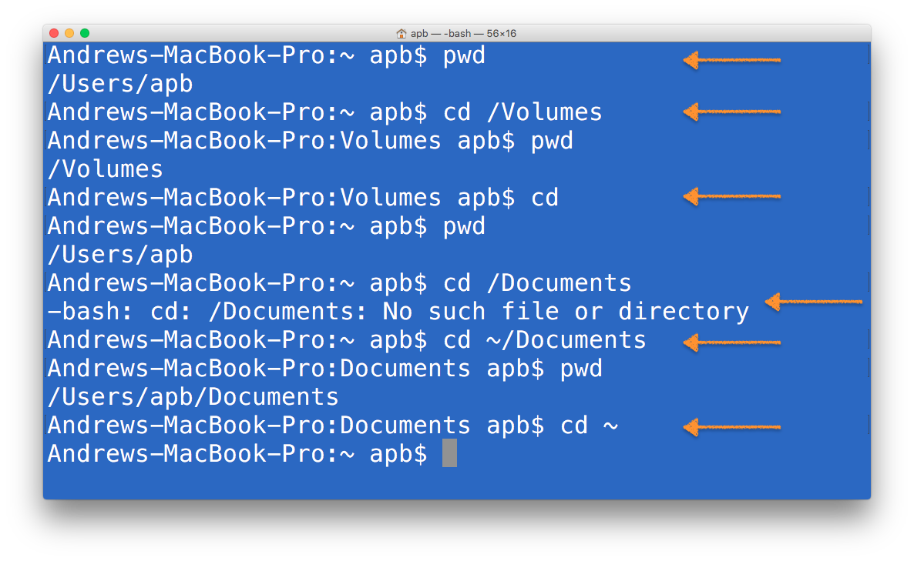
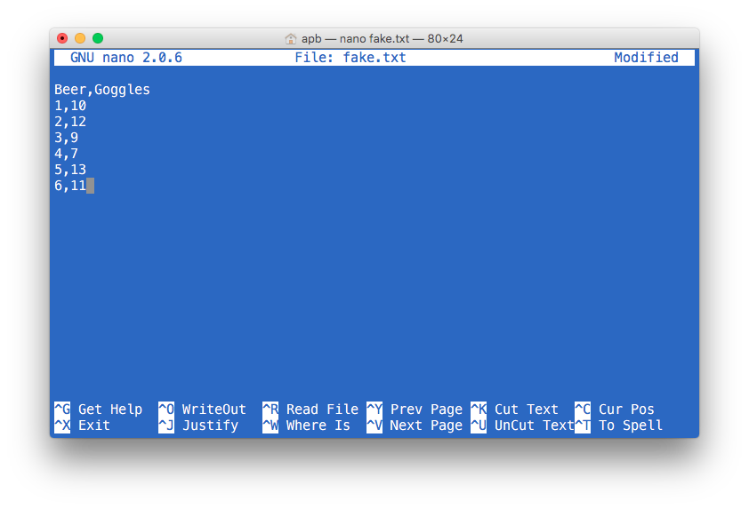
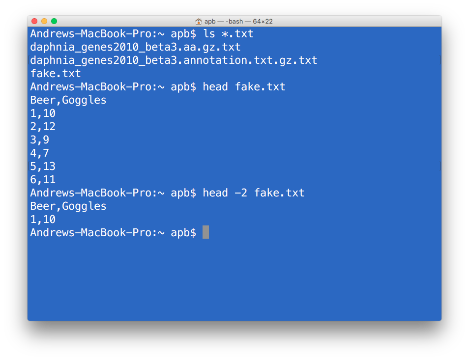

```{r setup, include=FALSE}
knitr::opts_chunk$set(echo = FALSE)
```

## Getting Started with Unix and R for Bioinformatics

You WILL use Unix.  You will probably also use Perl, Python and Java.  You will use these and R.  Bioinformatics is full of programming.  You will have to learn how to install programming languages, and applications writtne in these.  It is not trivial.  But the most important thing is to not be scared.  It will mess up.  All the time.  Don't forget it is a computer.  More than likely you can turn it off and on, and it will still work.  Just don't throw it out the window.

You will be tempted.

ALSO.  Don't forget the internet.  Stackoverflow is AWESOME and there are stacks of VERY HELPFUL people out there.  Getting help is NOT cheating.

Here we will get started with the basics of Unix... and the terminal.  You'll use this and more later in the week.  This will get you started and hopefully make you feel a bit more comfortable.  You should be able to start the terminal, or equivalent on windows (Cygwin)? 



## This will not be complete

There are several EXCELLENT tutorials online.  I like this one.

[Unix and Perl Primer for Biologists](http://korflab.ucdavis.edu/Unix_and_Perl/current.html#part1)

by Keith Bradnam & Ian Korf

## PATHS
Paths are the addresses to folders and files on your computer.  You need to get used to them.  You need to know that the hard drive has a name, and that you have a `HOME` and that when you make folders, inside folders etc, you are building "paths" around your computer.

#### *For example*
MAC/Linux/Unix: `/Users/Username/Documents/DaphniaGenomeResources`

Windows: `C:\Users\Username\Documents\DaphniaGenomeResources`

## Help Pages....
`man` will it be hard, but `man` can `man pages` help.  simply typing `man FunctionName` will get you help.

## Where Am I?  Where can I go?
The main command to find out where you are, is `pwd` for `print working directory`.  The command to move around is `cd` for `change directory`

The figure below shows the basics of how to use it.  One of the most important things to know is how to get `HOME`.  The commands `cd`, or more formally `cd ~`, will take you `HOME`.  

`cd ..` can be quite useful, as it moves you back up one level of your folder heirarchy.



## Making Directories
One of the things you will need to do 'inside' your computer is make directories.  We are mosty comfortable doing this in the Finder or Windows explorer, but not all parts of the OS are availble to use this, and it might be better to use the Unix commands when working with Unix files and non GUI programmes.

`mkdir` is the command to make a directory.  You can try this:

`mkdir BioInfoStuff`

Once you make this, move there....

`cd BioInfoStuff`

ADVANCED: It is also possible to make several directories (folders) at once, with some folders within other folders.  For example... here we make 5 folders at one level (apps, genomes, data, results and logfiles).  We also make two folders WITHIN data (raw and ready).  the `-p` argument creates intermediate directories as required.  

`mkdir -p apps genome data/raw data/ready results logfiles`

You can always use

`man mkdir`

to see what is possible!

## Seeing inside directories
`ls` is, as discussed in R, the *list* files command.  This will print to the screen a list of all non-hidden (!) files. Lets go to your home directory and try this.

$ `cd ~`

$ `ls`

Good.  There are many extras with `ls` that are very useful.  Here are a few that might help:

* `ls -l (long)`
* `ls -tlr (time, long, reverse)`
* `ls -R (recursive)`
* `ls -a (all - shows hidden files)`

## wildcard examples `*`
Sometimes, your work will generate many files with very similar names.  Lets say you have several candidate gene sets called 

* geneSet1\_A.txt 
* geneSet2\_A.txt 
* geneSet1\_B.txt
* geneSet2\_B.txt  

Now, lets imagine we want all the geneSet A's.  We can list these as follows, demonstrating the value of the `*`

`ls *A.txt`

This will assume anything can come before the `A`'s and .txt after it.

We could also get all of the geneSet2's using two * s

`ls *2*.txt`

Here we have ANYTHING before the 2 and after the two, followed by .txt.

## making files - data, scripts
You will shortly learn quite a bit about getting data from various places online or on your computer.  You've already seen this is also possible in R. 

For the next few sections, we need some made up data.  Lets try:

`cd ~`

`touch fake.txt`

This should create a file called fake.txt in your home directory.

`nano fake.txt`

This should open up the nano editor and this file. Once in there, you want to add some data.  We have a header line, and some numbers, all delimited by commas.



Once the data are scribbled, you can first WRITE OUT the file, and then EXIT nano.

Super.  You can check to see if this was made via Finder or Explorer.

Now some fun stuff. Like in R, `head` and `tail` both deliver information.  NOTE that we do not use `()`'s

`head fake.txt`

`tail fake.txt`

Note that the `man head` pages would indicate that you can specify the number of lines.

`head -2 fake.txt`



## MORE Options for looking in files.
display contents of files

* cat <file> - all lines 
* more <file> - all lines a screen at a time
* less <file> - forward or backwards movement through a file.

## Symbolic Links
Quite often we want to make SHORTCUTS to folders or to files or scripts.  Perhaps they are called something long and informative, but we need a short name.  Perhaps they are buried DEEP in our filesystem with a long path.  We can make a "shortcut" name for such things using *symbolic links* and the `ln` function.  For example...

`ln -s /gpfs/bb/<username>/rnaseq_analysis/finish/trimmed_reads/* trimmed_reads/`

This says make a *symbolic link* (shorthand) using `ln -s` for

`/gpfs/bb/<username>/rnaseq_analysis/finish/trimmed_reads/*` with a giant path, called simply *trimmed_reads/*

The important thing to remember is that this shorthand shortcut will CEASE to work if you move all those trimmed_reads to a new location.

## Protect and Execute
You will bring raw data into your computing world.  Sometimes, it can be a good idea to PREVENT yourself from altering these data.  You can do this by changing permissions.  We use the `chmod` function to do this.  For example, protect your data by making it READ ONLY, we could 

`chmod 444 fake.txt`

You will also MAKE SCRIPTS.  These need to be executable - i.e. they need permission to run in the OS.  To do this, we also use `chmod`.  For example, when you make a script to do a bunch of stuff, and call it *mySuperbScript.sh*, you will need to give it permission to use the computing resources on your machine:

`chmod 755 mySuperbScript.sh`

## Using other programmes, like samtools or bowtie.
There is a convention in unix like syntax for using other programming languages (java, python) or compiled tools like *samtools* or *bowtie*.  As in R, function take arguments.  You've seen this already.

`ls -a`

Here, the function `ls` takes an argument `-a` that says list ALL, including hidden files.

You will using some fancy programmes like *samtools*.  You will be asked to do stuff like this:

`samtools flagstat accepted_hits.bam`

This says, "Hey *samtools*, use your function *flagstat* on my *accepted_hits.bam* file, please"

Just get used to there being a programme (samtools), a function (flagstat) and typically a file to work on and OFTEN a file to write to!

`samtools view -b accepted_hits.bam 36 > SampleA_Control.scaf36.bam`

Hey *samtools*, use your *view* function, with argument *b* on *accepted_hits.bam*, *scaffold 36* and write this to *SampleA_Control.scaf36.bam*

## See what's happening

* top - examine resource usage (still running?)
* ps (ps ux) - process status

## R vs. Unix

MAKE A TABLE with getwd/pwd setwd/cd ls/ls head, tail, wc/str, cat, > vs <-